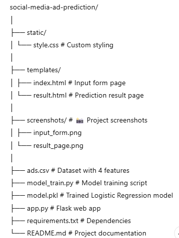
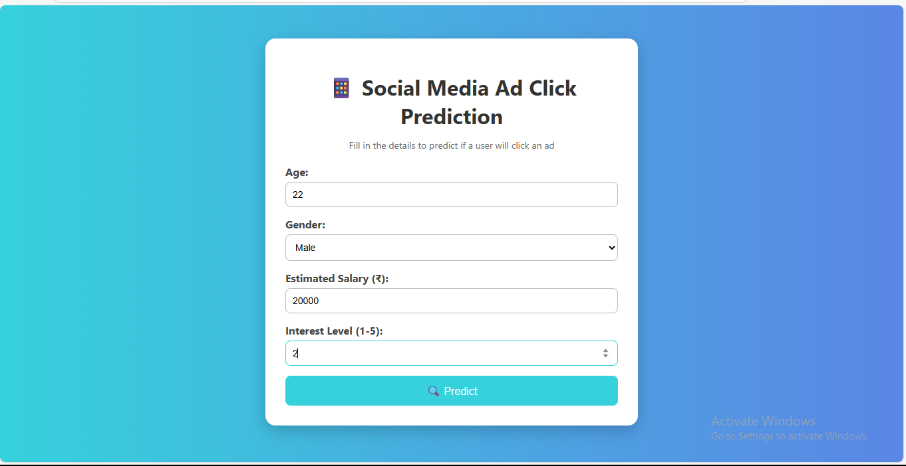
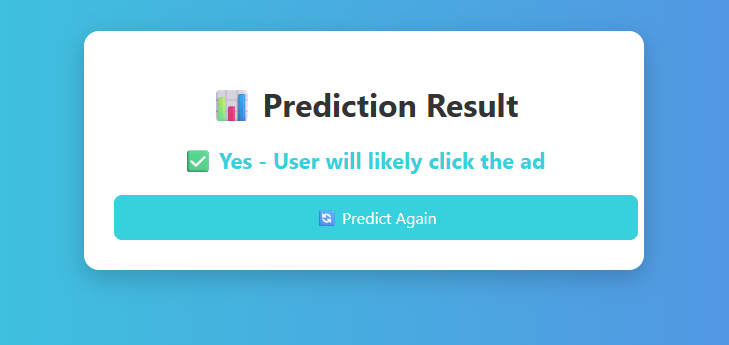

# 📱 Social Media Ad Click Prediction (Logistic Regression)

A **Flask-based Machine Learning web application** that predicts whether a user will **click on a social media advertisement** based on their age, gender, estimated salary, and interest level.  
The prediction is powered by a **Logistic Regression model**.

---

## 🔍 Overview
Digital advertisers aim to show ads to users who are most likely to click on them.  
This project predicts ad click probability using:
- **Age**
- **Gender**
- **Estimated Salary**
- **Interest Level (1-5)**

The web app provides **real-time predictions** through a clean, responsive interface.

---

## ✨ Features
- 📌 Predicts whether a user will **click an ad**
- 🤖 Uses **Logistic Regression** for binary classification
- 📂 CSV-based dataset for easy modification
- 🖥 Responsive **HTML/CSS frontend**
- ⚡ Flask-powered real-time prediction

---

## 🛠 Tech Stack
- **Python 3.10+**
- **Flask**
- **scikit-learn**
- **pandas**
- **HTML/CSS**

---

## 📂 Project Structure

---

## ⚙ Installation & Setup

### 1️⃣ Clone the Repository

git clone https://github.com/yourusername/social-media-ad-prediction.git
cd social-media-ad-prediction

### 2️⃣ Install Dependencies

pip install -r requirements.txt

### 3️⃣ Train the Model

python model_train.py
This will create model.pkl.

### 4️⃣ Run the Web App

python app.py
Open in your browser:

http://127.0.0.1:5000/

## 📸 Screenshots

### 🖥 Input Form

### 📊 Prediction Result

### 💡 Use Cases
📱 Social Media Marketing for ad targeting

📊 Customer segmentation

🎓 ML binary classification examples

### 📌 Future Enhancements
Add probability score for click likelihood

Include more features like location & device type

Deploy online via Heroku or Render